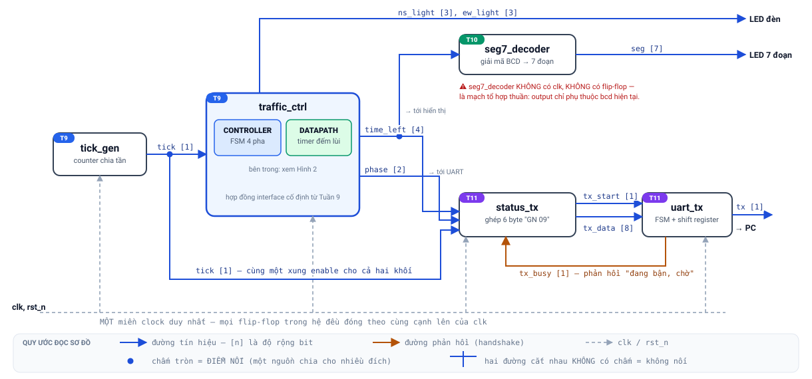
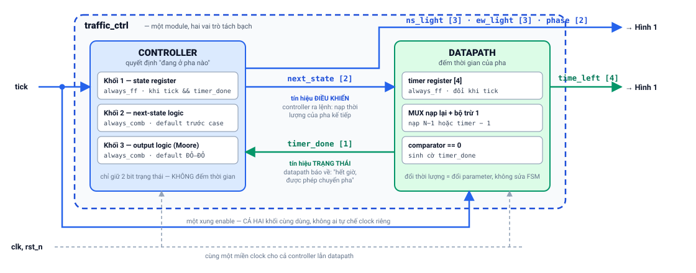

# PROJECT_GUIDE — Smart Traffic Controller FPGA System (Tuần 9–11)

Một project duy nhất, lớn dần qua ba tuần, bảo vệ ở tuần 12. Tài liệu này là đặc tả kỹ thuật gốc; các trang Week09/10/11.html dạy cách xây từng phần.

## 1. Đặc tả hệ thống (system specification)

**Yêu cầu chức năng**
1. Điều khiển đèn ngã tư hai hướng NS/EW, mỗi hướng {đỏ, vàng, xanh}; chu trình GREEN_NS → YELLOW_NS → GREEN_EW → YELLOW_EW → lặp.
2. Thời lượng xanh/vàng là parameter (`GREEN_TICKS` mặc định 10, `YELLOW_TICKS` mặc định 3, đơn vị giây, mỗi pha ≤ 15 s để timer 4 bit đủ).
3. Hiển thị số giây còn lại của pha trên LED 7 đoạn (1 digit; 2 digit multiplexed là mở rộng).
4. Mỗi giây gửi một dòng trạng thái dạng `GN 09\n` (6 byte ASCII) về PC qua UART 8N1, baud mặc định 115200.
5. Sau reset (`rst_n` = 0): hệ ở GREEN_NS, timer nạp đầy — hành vi xác định.

**Yêu cầu an toàn (safety invariant)** — kiểm tự động trong testbench ở MỌI cạnh clock:
> Tại mọi thời điểm sau reset, ít nhất một trong hai hướng đang ĐỎ. Tương đương: không bao giờ `ns_light != LAMP_RED && ew_light != LAMP_RED`.

**Ràng buộc thiết kế**
- MỘT clock duy nhất `clk` (50 MHz mặc định, parameter hóa). Mọi nhịp chậm (1 Hz, baud) đều là **clock-enable** từ counter — cấm derived clock (`@(posedge tick)`, lấy bit counter làm clock).
- Reset `rst_n` bất đồng bộ, tích cực mức thấp, dùng thống nhất.
- SystemVerilog synthesizable; style theo Week07 (3 ngôi nhà, `<=` tuần tự, default-trước tổ hợp, nối port theo tên).

## 2. Kiến trúc &amp; sơ đồ khối

Mục này mô tả kiến trúc ở hai mức: **mức đỉnh** (các module nối với nhau ra sao) và **mức bên trong `traffic_ctrl`** (controller và datapath phối hợp thế nào). Hình vẽ để hình dung; **bảng liên kết tín hiệu ở §2.4 mới là bản đặc tả chuẩn** — khi hình và bảng khác nhau, lấy bảng làm gốc, và bảng này khớp từng dòng với `traffic_system_top.sv` (Tuần 11).

### 2.1 Quy ước đọc sơ đồ

| Ký hiệu | Nghĩa |
|---|---|
| Mũi tên xanh dương | Đường tín hiệu; đầu mũi tên chỉ **chiều truyền** (từ nguồn tới đích) |
| `[n]` cạnh tên tín hiệu | **Độ rộng bit**. Ví dụ `time_left [4]` là bus 4 bit, khai báo `logic [3:0]` |
| Mũi tên cam | Đường **phản hồi** (feedback) trong cơ chế bắt tay — đích trả thông tin ngược về nguồn |
| Nét đứt xám | Phân phối `clk` và `rst_n` — vẽ tách riêng để sơ đồ tín hiệu không bị rối |
| ● Chấm tròn | **Điểm nối**: một nguồn chia tín hiệu cho nhiều đích (fan-out) |
| Hai đường cắt nhau **không** có chấm | **Không nối** — chỉ là giao nhau khi vẽ trên mặt phẳng |

Quy ước chấm-nối/không-nối là chuẩn đọc sơ đồ mạch; học viên cần quen ngay từ đây vì mọi schematic và block diagram trong ngành đều dùng.

### 2.2 Cây phân cấp module (module hierarchy)

```
traffic_system_top                          ← module đỉnh: CHỈ khai báo dây và nối module,
│                                             không chứa logic nào của riêng nó
├── u_tick : tick_gen     #(DIV)            ← T9  · tuần tự
├── u_ctrl : traffic_ctrl #(GREEN_TICKS, YELLOW_TICKS)  ← T9 · tuần tự (chứa controller + datapath)
├── u_seg  : seg7_decoder                   ← T10 · TỔ HỢP thuần (không có clk)
├── u_stat : status_tx                      ← T11 · tuần tự
└── u_tx   : uart_tx      #(CLK_HZ, BAUD)   ← T11 · tuần tự
```

`display_mux` (mở rộng T10) không nằm trong cây trên: nếu dùng, nó thay chỗ `u_seg` và **chứa bên trong một instance `seg7_decoder`** — tức là hierarchy sâu thêm một tầng, phần còn lại của hệ không đổi.

### 2.3 Sơ đồ khối mức đỉnh



*Hình 1 — Sơ đồ khối mức đỉnh (`traffic_system_top`). Nhãn T9/T10/T11 cho biết module được xây ở tuần nào.*

Đọc hình theo **ba luồng**, mỗi luồng trả lời một câu hỏi:

1. **Luồng nhịp — "hệ đếm thời gian bằng gì?"** `clk` (50 MHz) vào `tick_gen`; `tick_gen` đếm đủ `DIV` chu kỳ thì phát một xung `tick` rộng đúng 1 chu kỳ. Xung này đi tới **cả hai** khối cần nhịp giây: `traffic_ctrl` (để đếm thời lượng pha) và `status_tx` (để mỗi giây gửi một dòng trạng thái). Chấm tròn trên đường `tick` chính là điểm chia đó.
2. **Luồng trạng thái — "hệ đang ở pha nào, còn mấy giây?"** `traffic_ctrl` phát ba nhóm output: `ns_light`/`ew_light` ra LED đèn; `time_left` chia cho **hai** đích (`seg7_decoder` để hiển thị và `status_tx` để báo cáo); `phase` tới `status_tx`.
3. **Luồng báo cáo — "làm sao nói chuyện với PC?"** `status_tx` ghép chuỗi 6 byte rồi đưa từng byte sang `uart_tx` qua cặp `tx_start`/`tx_data`; `uart_tx` trả về `tx_busy` để `status_tx` biết khi nào được gửi byte kế tiếp. Đây là **bắt tay hai chiều** — lý do phải có mũi tên cam đi ngược.

Hai chi tiết dễ bỏ sót nhưng rất quan trọng về học thuật:

- `clk`/`rst_n` đi tới **mọi khối tuần tự** (`tick_gen`, `traffic_ctrl`, `status_tx`, `uart_tx`), không chỉ tới khối đầu tiên. Toàn hệ nằm trong **một miền clock duy nhất**.
- `seg7_decoder` **không** có `clk` và **không** có flip-flop nào, vì nó là mạch tổ hợp thuần: output chỉ là hàm của `bcd` hiện tại. Đây là khối duy nhất trong hệ như vậy — dùng nó để kiểm tra học viên có phân biệt được tổ hợp và tuần tự hay không.

### 2.4 Bảng liên kết tín hiệu (đặc tả chuẩn)

Bảng dưới liệt kê **toàn bộ tín hiệu ở mức đỉnh**: cổng của `traffic_system_top` và dây nối giữa các module. Tín hiệu *bên trong* một module không thuộc bảng này (`next_state`, `timer_done` — §2.5; `baud_tick` — §2.6). Đây là bản đặc tả không mơ hồ mà hình vẽ không thể thay thế: mỗi dòng ghi rõ nguồn, các đích, độ rộng.

**Cổng của `traffic_system_top`**

| Tín hiệu | Chiều | Rộng | Nối tới | Ý nghĩa |
|---|---|---|---|---|
| `clk` | vào | 1 bit | `u_tick`, `u_ctrl`, `u_stat`, `u_tx` | Clock hệ thống (mặc định 50 MHz), từ thạch anh/PLL trên board |
| `rst_n` | vào | 1 bit | `u_tick`, `u_ctrl`, `u_stat`, `u_tx` | Reset bất đồng bộ, tích cực mức thấp |
| `ns_light` | ra | 3 bit `[2:0]` | chân LED trên board | Đèn hướng Bắc–Nam, mã `{đỏ, vàng, xanh}` |
| `ew_light` | ra | 3 bit `[2:0]` | chân LED trên board | Đèn hướng Đông–Tây, cùng mã |
| `seg` | ra | 7 bit `[6:0]` | chân LED 7 đoạn | Bảy đoạn `{g,f,e,d,c,b,a}` |
| `tx` | ra | 1 bit | chân nối cầu USB-UART | Đường nối tiếp ra PC, idle mức 1 |

**Dây nối nội bộ giữa các module**

| Tín hiệu | Rộng | Nguồn | Đích | Ý nghĩa |
|---|---|---|---|---|
| `tick` | 1 bit | `u_tick.tick` | `u_ctrl.tick`, `u_stat.tick` | Xung **enable** rộng đúng 1 chu kỳ `clk`, phát 1 lần mỗi giây. **Không phải clock** |
| `phase` | 2 bit `[1:0]` | `u_ctrl.phase` | `u_stat.phase` | Mã pha hiện tại: 0 = GREEN_NS, 1 = YELLOW_NS, 2 = GREEN_EW, 3 = YELLOW_EW |
| `time_left` | 4 bit `[3:0]` | `u_ctrl.time_left` | `u_seg.bcd`, `u_stat.time_left` | Số giây còn lại của pha. **Fan-out 2** — chính là chấm tròn trên Hình 1 |
| `tx_start` | 1 bit | `u_stat.tx_start` | `u_tx.start` | Xung 1 chu kỳ: yêu cầu `uart_tx` phát một byte |
| `tx_data` | 8 bit `[7:0]` | `u_stat.tx_data` | `u_tx.data` | Byte cần phát, được `uart_tx` chốt lại tại thời điểm `start` |
| `tx_busy` | 1 bit | `u_tx.busy` | `u_stat.tx_busy` | **Phản hồi**: bằng 1 khi `uart_tx` đang phát khung; `status_tx` phải đợi nó về 0 mới gửi byte kế |

Đếm lại cho khớp: hệ có đúng **6 dây nội bộ** (`tick`, `phase`, `time_left`, `tx_start`, `tx_data`, `tx_busy`) và **6 cổng** ở mức đỉnh (2 vào: `clk`, `rst_n`; 4 ra: `ns_light`, `ew_light`, `seg`, `tx`). Nếu code của nhóm sinh ra nhiều/ít hơn, kiến trúc đã lệch khỏi đặc tả.

### 2.5 Bên trong `traffic_ctrl` — mô hình Controller / Datapath



*Hình 2 — Bên trong `traffic_ctrl`. Đây là mô hình **controller–datapath** kinh điển của thiết kế số.*

Hai khối trao đổi đúng **hai** tín hiệu, và mỗi tín hiệu có một vai trò được đặt tên trong lý thuyết thiết kế số:

- **`next_state` — tín hiệu điều khiển (control signal), đi từ controller xuống datapath.** Controller "ra lệnh": pha kế tiếp là pha nào, để datapath biết phải nạp thời lượng nào vào timer.
- **`timer_done` — tín hiệu trạng thái (status signal), đi từ datapath ngược lên controller.** Datapath "báo cáo": đã đếm hết giờ, controller được phép chuyển pha.

Chiều đi ngược nhau của hai tín hiệu này chính là đặc trưng của mô hình: **điều khiển đi xuống, trạng thái đi lên**. Nhận ra được cặp control/status trong một thiết kế bất kỳ là một trong những kỹ năng đọc kiến trúc quan trọng nhất của khóa học.

Vì sao phải tách? Nếu nhét thời gian vào trạng thái (mỗi giây một state), FSM sẽ có hàng chục state và **đổi thời lượng đèn phải vẽ lại toàn bộ FSM**. Tách ra: FSM cố định 4 state, thời lượng chỉ là `parameter` của datapath. Đây là lý do kiến trúc này được dạy ở mọi giáo trình thiết kế số, và là câu hỏi vấn đáp bắt buộc ở Tuần 12.

### 2.6 Năm quy tắc kiến trúc đọc được từ hai hình

1. **Một miền clock duy nhất.** Mọi flip-flop trong hệ đóng theo cùng cạnh lên của `clk`. Không có clock thứ hai ở bất kỳ đâu.
2. **Nhịp chậm là clock-enable, không phải clock.** `tick` (1 Hz) và `baud_tick` (trong `uart_tx`) đều là tín hiệu dữ liệu điều khiển việc *cho phép cập nhật*; cấm `@(posedge tick)` và cấm lấy bit của counter làm clock.
3. **Mạch tổ hợp không có clk.** `seg7_decoder` là ví dụ đối chứng trong hệ — nhìn vào sơ đồ phải trả lời được ngay vì sao nó không nhận `clk`.
4. **Hai khối chạy khác nhịp thì nối bằng bắt tay.** Mỗi khi có `tick`, `status_tx` muốn đẩy 6 byte liên tiếp theo nhịp `clk` — vài chu kỳ một byte. `uart_tx` thì cần trọn 10 bit-time (≈ 10 × CLK_HZ/BAUD chu kỳ) mới xong **một** byte. Bên sản xuất nhanh hơn bên tiêu thụ hàng nghìn lần, nên phải có `tx_busy` phản hồi để ghìm `status_tx` lại; không có nó, 5 byte sau bị nuốt mất.
5. **Hợp đồng interface: module đã giao thì không sửa lại.** Các tuần sau chỉ *nối thêm dây* vào cổng có sẵn. `phase` và `time_left` được `traffic_ctrl` xuất ra ngay từ Tuần 9 dù Tuần 9 chưa dùng tới — đó là chủ đích thiết kế cho hai tuần kế tiếp. Nhóm nào phải sửa `traffic_ctrl` khi làm T10/T11 thì dừng lại và hỏi: "có cách nào không sửa không?"

## 3. Interface từng module (hợp đồng cố định)

| Module | Tuần | Ports | Ghi chú |
|---|---|---|---|
| `tick_gen #(DIV)` | 9 | in: `clk, rst_n` · out: `tick` | tick rộng đúng 1 chu kỳ clk; DIV = f_clk (50_000_000 → 1 Hz); mô phỏng dùng DIV nhỏ (10) |
| `traffic_ctrl #(GREEN_TICKS, YELLOW_TICKS)` | 9 | in: `clk, rst_n, tick` · out: `ns_light[2:0], ew_light[2:0], phase[1:0], time_left[3:0]` | Mã đèn: RED=3'b100, YELLOW=3'b010, GREEN=3'b001. phase: 0=GREEN_NS, 1=YELLOW_NS, 2=GREEN_EW, 3=YELLOW_EW |
| `seg7_decoder` | 10 | in: `bcd[3:0]` · out: `seg[6:0]` | Tổ hợp thuần; seg = {g,f,e,d,c,b,a}, active-high (đổi cực theo board); ngoài 0–9 hiện "-" |
| `display_mux #(REFRESH_DIV)` | 10 (mở rộng) | in: `clk, rst_n, digit1[3:0], digit0[3:0]` · out: `seg[6:0], an[1:0]` | Quét ~1 kHz; chứa 1 instance seg7_decoder |
| `uart_tx #(CLK_HZ, BAUD)` | 11 | in: `clk, rst_n, start, data[7:0]` · out: `tx, busy` | 8N1, LSB first, idle=1; start khi busy bị bỏ qua (ghi trong spec) |
| `status_tx` | 11 | in: `clk, rst_n, tick, phase[1:0], time_left[3:0], tx_busy` · out: `tx_start, tx_data[7:0]` | Mỗi tick gửi 6 byte "PP TT\n" qua handshake start/busy |
| `traffic_system_top #(CLK_HZ, BAUD)` | 11 | in: `clk, rst_n` · out: `ns_light, ew_light, seg, tx` | Chỉ instantiate + nối dây |

RTL đầy đủ của từng module nằm trong Layer C các trang: tick_gen + traffic_ctrl + tb_traffic (Week09), seg7_decoder + display_mux (Week10), uart_tx + status_tx + traffic_system_top + tb_uart_tx (Week11).

## 4. Milestones

| Mốc | Hạn | Bằng chứng phải có |
|---|---|---|
| M1 — Thiết kế giấy | trong buổi T9 | State diagram 4 pha + bảng output (có cột kiểm invariant) + waveform 12 tick dự đoán |
| M2 — Lõi chạy đúng | trước buổi T10 | tick_gen + traffic_ctrl + tb pass invariant; waveform 1 chu kỳ đèn chú thích 4 lần chuyển pha |
| M3 — Hệ có màn hình | trước buổi T11 | Top T9+T10 mô phỏng; waveform chỗ chuyển pha: time_left nạp lại + seg đổi; 3 dòng "tôi phải sửa gì để ghép" |
| M4 — Hệ hoàn chỉnh | trước buổi T12 | traffic_system_top mô phỏng ra frame UART đúng (start bit dài đúng CLK_HZ/BAUD chu kỳ — 8 chu kỳ với tỉ lệ thu nhỏ 8:1; đừng nhầm với `DIV` của `tick_gen`. Thứ tự bit đúng LSB-first); nếu có board: ảnh serial terminal |
| M5 — Bảo vệ | buổi T12 | Demo + phiếu bảo vệ 9 mục + trả lời vấn đáp + portfolio 12 mục |

## 5. Verification plan

- **Mọi mốc mô phỏng với tham số thu nhỏ** (DIV=10; GREEN=6/YELLOW=2; CLK_HZ/BAUD tỉ lệ nhỏ như 8:1) — logic không đổi, mô phỏng nhanh.
- **Invariant an toàn** (T9): chạy ở mọi cạnh clock, mọi kịch bản; testbench có kịch bản reset giữa chừng.
- **Self-check hiển thị** (T10): so seg với bảng giải mã của time_left tại mỗi tick; edge case: thời điểm nạp lại timer; giá trị ngoài 0–9 phải ra "-".
- **Đo bằng số cho UART** (T11): độ dài start bit đếm bằng chu kỳ; thứ tự bit của 0x41; start-khi-busy bị bỏ qua; khung liền nhau nối bằng idle mức 1.
- Edge case chung phải chạm: reset (giữ vài chu kỳ, thả giữa chừng hoạt động), giá trị min/max (timer 0, time_left lớn nhất), biên chuyển (tick trùng timer_done), tràn counter (mô phỏng đủ >1 chu kỳ lặp).
- Nguyên tắc: **kết luận phải có bằng chứng** — mỗi mốc nộp waveform có chú thích tay, không nộp "em thấy chạy đúng".

## 6. Kết quả kỳ vọng & FPGA deployment (tùy chọn)

- Bắt buộc: toàn hệ mô phỏng đúng như mục 5. Không bắt buộc có board.
- Nếu có board (Basys/DE10/Tang Nano…): gán chân theo sơ đồ board (clk, rst_n vào nút/switch, ns/ew ra LED, seg ra LED 7 đoạn, tx vào chân cầu USB-UART); synthesis → implementation → nạp bitstream (T8: đây là configuration, không phải "ghi chương trình"); mở PuTTY/Tera Term đúng baud. Lưu ý thực tế: cực tính LED 7 đoạn (common anode/cathode) có thể ngược — đổi ở một chỗ duy nhất (seg7_decoder), đúng bài học interface.

## 7. Rubric project (dùng cho M2–M4, chấm cộng dồn về T12)

| Tiêu chí | Trọng số | Đạt khi… |
|---|---|---|
| Hiểu khái niệm | 25% | Giải thích được mọi quyết định: vì sao tách controller/datapath, vì sao enable không phải clock, vì sao nạp N−1… |
| Kiến trúc | 20% | Đúng hợp đồng interface; module cũ không bị sửa khi tích hợp; block diagram khớp code |
| RTL đúng | 20% | Style Week07; compile sạch không latch; hành vi khớp spec (chu trình pha, khung UART) |
| Verification | 20% | Đủ plan mục 5; invariant + số đo; waveform chú thích làm bằng chứng |
| Giao tiếp kỹ thuật | 15% | Kể được ít nhất 1 bug thật + cách tìm; trình bày mạch lạc tại M5 |

## 8. Mở rộng (không bắt buộc, có hướng dẫn trong bài)
- All-red clearance phase (T9 nâng cao — thiết kế giấy).
- Display 2 digit multiplexed, GREEN_TICKS > 9 (T10 nâng cao).
- Thông điệp UART dài hơn: `S=GN T=09\n` (10 byte) thay cho mặc định `GN 09\n` (6 byte); parity 8E1 (T11 nâng cao).
- Nút bộ hành (cần synchronizer 2 FF — cơ hội dạy 5.6 bằng thực hành, Phase 2).

---

**Khoa Điện – Điện tử · Trường Kỹ thuật · Đại học Phenikaa** · Biên soạn: **Giảng Viên Đinh Văn Nam**  
© 2026 · Bản quyền thuộc về Giảng Viên Đinh Văn Nam, Khoa Điện-Điện Tử, Trường Kỹ Thuật, Đại học Phenikaa. Tài liệu phục vụ đào tạo — vui lòng giữ nguyên thông tin tác giả khi chia sẻ hoặc trích dẫn.
