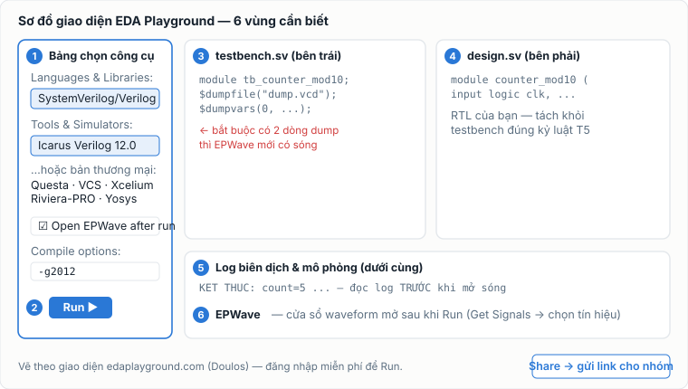

## 1. Bản chất: simulator thật, chạy trên máy chủ, hiện lên trình duyệt

Hiểu sai phổ biến: "chạy trên web chắc là bản mô phỏng giả lập, không chuẩn". Sai. EDA
Playground (do **Doulos** — công ty đào tạo thiết kế vi mạch lâu năm — vận hành, miễn phí)
là một giao diện web; khi bấm **Run**, code của bạn được gửi tới máy chủ và chạy trên
**simulator thật**: đúng thời điểm đối chiếu bài này, bản Icarus Verilog trên đó là **12.0 —
cùng phiên bản bạn cài trên máy** theo [bài cầm tay chỉ việc](../chay-mo-phong-systemverilog-dau-tien/).
Cùng code, cùng simulator → cùng kết quả; khác nhau chỉ ở chỗ ai gõ lệnh thay bạn.

Điều đáng giá hơn: danh mục còn có **simulator thương mại** — Siemens Questa, Synopsys VCS,
Cadence Xcelium, Aldec Riviera-PRO — những cái tên bạn sẽ gặp trong JD tuyển dụng, vốn có giá
license vượt xa túi tiền sinh viên; và cả **Yosys** (synthesis mã nguồn mở). Đây là nơi duy
nhất bạn "chạm" được chúng miễn phí, hợp pháp, không cài đặt.

## 2. Sáu vùng giao diện — nhìn một lần là thuộc

Quy trình 5 bước cho bài chạy đầu tiên:

1. **Đăng nhập** (bắt buộc để Run — tài khoản Google là đủ cho công cụ miễn phí; đăng ký
   đầy đủ nếu muốn dùng trọn bộ công cụ thương mại).
2. Cột trái: **Languages & Libraries → SystemVerilog/Verilog**; **Tools & Simulators →
   Icarus Verilog** (chọn bản mới nhất có trong danh sách).
3. Dán **testbench vào khung trái, design vào khung phải** — hai khung tách bạch đúng kỷ
   luật "testbench không phải là thiết kế" của Tuần 5.
4. Trong testbench phải có `$dumpfile("dump.vcd"); $dumpvars(0, tên_module_tb);` và tích ô
   **Open EPWave after run** — thiếu một trong hai là chạy xong không có sóng để xem.
5. Bấm **Run** → đọc **log** ở khung dưới TRƯỚC (pass/fail, `$display`, `$error`), rồi mới
   mở **EPWave**: bấm *Get Signals*, chọn tín hiệu cần xem, kéo vào khung sóng.

Bài tập kiểm chứng 10 phút: lấy đúng cặp `counter_mod10.sv` + `tb_counter_mod10.sv` trong
[bài lab](../chay-mo-phong-systemverilog-dau-tien/), dán lên EDA Playground, chạy — log phải in
đúng dòng `KET THUC: count=5...` như trên máy. Cùng code, cùng simulator, cùng kết quả:
bạn vừa tự chứng minh điều đó.

## 3. Ba cách dùng "ăn tiền" mà ít người tận dụng

**a. Link chia sẻ = cách hỏi bài chuẩn.** Nút **Share** tạo link cố định chứa nguyên trạng
code + cấu hình của bạn (chọn được mức riêng tư: ai có link / công khai tìm được / riêng tư).
Từ nay, khi hỏi trên [Discussions của hub](../../community/), thay vì dán 80 dòng code vào
bài viết, hãy dán **một link playground** kèm ba câu: *mình làm gì — mình dự đoán gì — thực
tế ra gì*. Người trả lời bấm vào, sửa, chạy, gửi lại link bản sửa. Vòng hỏi–đáp nhanh gấp
nhiều lần, và đây cũng chính là nếp làm việc nhóm: cả nhóm nhìn cùng một mạch đang chạy,
không ai phải "cài cho giống máy tớ".

**b. Trọng tài thứ hai khi nghi ngờ simulator.** Gặp hành vi khó hiểu trên máy? Chạy đúng
code đó với một simulator KHÁC trên Playground (ví dụ Questa). Hai simulator ra cùng kết quả
→ gần như chắc chắn vấn đề nằm ở hiểu biết của bạn về ngôn ngữ, không phải ở tool. Ra khác
nhau → bạn vừa chạm một vùng ngữ nghĩa tinh tế — mang lên Discussions, đó là câu hỏi hay.

**c. Nếm chuẩn công nghiệp sớm.** Từ Tuần 8, khi giáo trình nói về synthesis và các chủ đề
Phase 2, bạn có thể thử: chạy cùng testbench trên Questa/VCS để thấy thông báo lỗi "giọng
công nghiệp" khác Icarus thế nào (thường chi tiết và khó tính hơn — ví dụ chúng chạy được
concurrent assertion mà Icarus không hỗ trợ). Không bắt buộc, nhưng 30 phút tò mò này khiến
JD tuyển dụng bớt xa lạ hẳn.

## 4. EPWave so với GTKWave — dùng cái nào?

| | EPWave (trên Playground) | GTKWave (trên máy) |
|---|---|---|
| Cài đặt | không | có (kèm bộ cài của khóa) |
| Mở nhanh xem liền | tốt cho bài nhỏ | tốt |
| Làm việc dài, nhiều tín hiệu, đo con trỏ, lưu cấu hình sóng | hạn chế hơn | **mạnh hơn rõ** |
| Waveform cho báo cáo/portfolio | chụp được | chuẩn của khóa (chú thích rồi nộp) |

Kết luận thực dụng: EPWave để *xem nhanh và chia sẻ*; phân tích sâu và làm artifact nộp bài
thì về GTKWave.

## 5. Ranh giới nên/không nên — đọc kỹ một lần

- **Cần Internet + đăng nhập; code đi qua máy chủ bên thứ ba.** Tuyệt đối không dán nội dung
  chưa được phép công bố (đề tài nghiên cứu chưa công bố, code có ràng buộc bảo mật, thông
  tin cá nhân). Bài tập của giáo trình thì thoải mái.
- **Tài nguyên chạy có giới hạn** (nền tảng miễn phí dùng chung): mô phỏng quá dài/nặng có
  thể bị cắt — dấu hiệu bạn nên chuyển về máy.
- **Không thay được môi trường local cho project 4–5 file trở lên** (hệ Tuần 9–11): quản
  nhiều file, chạy đi chạy lại, script hóa (`run.sh` trong
  [bài Icarus chuyên sâu](../icarus-verilog-tu-ban-chat-den-thanh-thao/)) — máy của bạn làm
  tốt hơn hẳn. Lộ trình chuẩn của khóa: **Tuần 3–4 dùng Playground → Tuần 5 trở đi song song
  chuyển về máy → project Tuần 9–11 chủ lực trên máy, Playground giữ vai trò chia sẻ/hỏi bài.**
- Giao diện và danh sách công cụ trên trang có thể thay đổi theo thời gian — tên nút có thể
  khác đôi chút so với sơ đồ; logic 6 vùng thì ổn định.

## Tóm tắt một câu

EDA Playground = **cùng một simulator bạn dùng trên máy, cộng thêm ba siêu năng lực: không
cần cài, chia sẻ bằng một link, và cánh cửa hé vào công cụ công nghiệp** — dùng nó cho đúng
ba việc đó, phần còn lại để máy của bạn làm.
