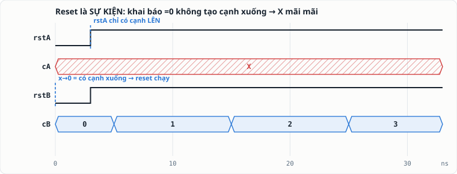
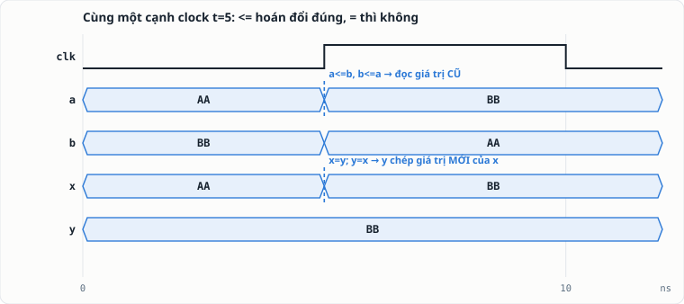
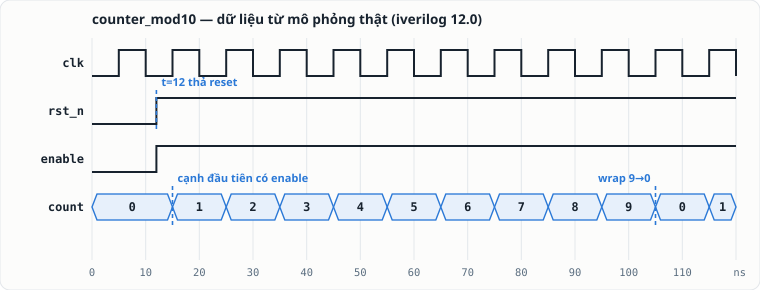

Bạn đã chạy được `iverilog` và `vvp` theo [bài cầm tay chỉ việc](../chay-mo-phong-systemverilog-dau-tien/).
Bài này trả lời câu hỏi tiếp theo, quan trọng hơn: **chuyện gì thật sự xảy ra khi bạn gõ hai
lệnh đó** — vì người tin mù công cụ sẽ đổ lỗi sai chỗ khi có bug, còn người hiểu công cụ thì
đọc được cả những gì nó *không* nói.

## 1. Bản chất: một compiler và một máy ảo

`iverilog` không "chạy" code của bạn. Nó **biên dịch** RTL + testbench thành một chương trình
bytecode, rồi `vvp` — một **máy ảo** — thực thi chương trình đó. Đừng tin lời — hãy tự mở file
`sim` bạn vừa tạo ra:

```bash
head -3 sim
```

```text
#! /usr/bin/vvp
:ivl_version "12.0 (stable)";
:ivl_delay_selection "TYPICAL";
```

Dòng đầu là shebang trỏ tới `vvp` — nghĩa là file `sim` là một "chương trình" viết bằng
assembly riêng của Icarus. Mô hình này giống hệt `javac` + JVM bên phần mềm. Hệ quả thực
dụng: **lỗi biên dịch** (cú pháp, port không khớp) hiện ở bước `iverilog`; **lỗi hành vi**
(mạch chạy sai) chỉ lộ ra ở bước `vvp` — biết lỗi thuộc bước nào là đã khoanh vùng được một nửa.

## 2. Mô phỏng là một vòng lặp sự kiện — và bài học đắt giá nhất

Simulator không "chạy code từ trên xuống dưới". Nó giữ một **lịch sự kiện theo thời gian ảo**:
tín hiệu đổi giá trị → sự kiện; sự kiện đánh thức các khối `always` đang chờ nó; các khối đó
tính toán và có thể tạo sự kiện mới; hết việc ở thời điểm hiện tại thì đồng hồ ảo nhảy đến sự
kiện kế tiếp. Nguyên tắc sắt: **không có sự kiện thì không có gì chạy.**

Nghe trừu tượng? Đây là thí nghiệm làm chính người viết bài này sững lại. Hai bộ đếm giống
hệt nhau, chỉ khác *cách reset về 0*:

```systemverilog
// Cách A: khởi tạo 0 NGAY KHI KHAI BÁO
logic rstA = 0;
always @(posedge clk or negedge rstA) if (!rstA) cA <= 0; else cA <= cA + 1;

// Cách B: gán 0 trong initial (tại t=0)
logic rstB;
initial rstB = 0;
always @(posedge clk or negedge rstB) if (!rstB) cB <= 0; else cB <= cB + 1;
```

Kết quả chạy thật (cả hai đều thả reset ở t=3):



`cA` **kẹt ở X vĩnh viễn** dù reset "trông" đúng. Vì sao? Khối `always` chỉ thức dậy khi có
**cạnh xuống của rstA** — mà `logic rstA = 0` khởi tạo giá trị *trước khi mô phỏng bắt đầu*,
không tạo ra chuyển tiếp nào cả. Không cạnh xuống → nhánh reset không bao giờ chạy → `cA`
giữ nguyên X, và `X + 1 = X` mãi mãi. Cách B thì `x → 0` tại t=0 **là** một cạnh xuống thật
→ reset chạy → đếm bình thường.

Bài học kép: (1) hiểu event-driven không phải kiến thức trang trí — nó giải thích những bug
"ma quái" nhất; (2) trong testbench, **lái reset bằng phép gán trong `initial`**, đúng như
mẫu của giáo trình Tuần 5.

## 3. `=` và `<=` — nhìn thấy sự khác nhau, không học thuộc nữa

Quy tắc Tuần 7 là "tuần tự dùng `<=`". Simulator cho bạn *nhìn thấy* lý do. Hai cặp thanh
ghi cùng hoán đổi giá trị tại một cạnh clock:

```systemverilog
always @(posedge clk) begin a <= b; b <= a; end   // nonblocking
always @(posedge clk) begin x = y;  y = x;  end   // blocking
```



Kết quả in ra từ `vvp` (nguyên văn):

```text
  nonblocking: a=bb b=aa  (hoan doi dung)
  blocking   : x=bb y=bb  (ca hai cung gia tri!)
```

Cơ chế: với `<=`, simulator **đọc hết vế phải bằng giá trị CŨ trước**, rồi mới cập nhật đồng
loạt ở cuối bước thời gian (vùng cập nhật nonblocking theo chuẩn IEEE 1800) — đúng như một
hàng flip-flop thật cùng chụp tại một cạnh clock. Với `=`, `x = y` cập nhật `x` **ngay lập
tức**, nên dòng sau `y = x` chép giá trị *mới* — thành ra cả hai cùng bằng `BB`. Đây không
phải "quy ước style": nó là khác biệt ngữ nghĩa mà phần cứng thật buộc bạn theo.

## 4. X không phải "ngẫu nhiên" — nó là còi báo động

`X` nghĩa là *chưa biết*, và nó **lan truyền**: `X + 1 = X`, `X & 1 = X`. Điều tưởng phiền
này lại là công cụ debug mạnh nhất bạn có: một thanh ghi quên khởi tạo sẽ kéo theo một vệt X
chạy dọc thiết kế — lần ngược vệt X trên waveform là ra tận gốc lỗi. (Vì sao FF "khởi động
bằng X" trong mô phỏng nhưng không hẳn vậy trên FPGA/ASIC — đọc bài
[FF khởi động với giá trị gì?](../reset-va-trang-thai-khoi-dong-flip-flop/).)

## 5. Giải phẫu một phiên làm việc chuẩn



```bash
iverilog -g2012 -o sim rtl.sv tb.sv   # BIÊN DỊCH: liệt kê đủ mọi file .sv
vvp sim                                # MÔ PHỎNG: chạy máy ảo
gtkwave wave.vcd                       # XEM SÓNG: file do $dumpvars tạo
```

Bốn "system task" bạn dùng mỗi ngày — vai trò khác nhau rõ rệt:

| Task | Vai trò | Khi nào dùng |
|---|---|---|
| `$display("...")` | in MỘT lần tại thời điểm gọi | mốc tiến trình, kết quả cuối |
| `$monitor("...")` | tự in MỖI KHI tín hiệu trong danh sách đổi | theo dõi liên tục vài tín hiệu nhỏ |
| `$dumpfile` + `$dumpvars` | ghi toàn bộ chuyển tiếp ra VCD | luôn luôn — không có nó là không có waveform |
| `$error` / `$fatal` | báo sai + (fatal) dừng ngay | **self-check**: testbench tự chấm thay vì bạn nhìn sóng bằng mắt |

Điểm tinh tế đã kiểm chứng: `$error` in `ERROR:` rồi **chạy tiếp** (gom được nhiều lỗi một
lần chạy); `$fatal` dừng ngay. Chọn theo mục đích: quét lỗi hàng loạt dùng `$error`, điều
kiện "chết là dừng" (safety invariant của project Tuần 9) dùng `$fatal`.

## 6. Đọc thông báo của công cụ — bằng thông báo THẬT

Ba tình huống hay gặp, tái tạo nguyên văn:

**Nối bus lệch độ rộng** — iverilog cảnh báo *mặc định*, đừng bỏ qua:

```text
warning: Port 1 (d) of m8 expects 8 bits, got 4.
       : Padding 4 high bits of the port.
```

Nó vẫn biên dịch (tự đệm bit cao) — nhưng "tự đệm" hiếm khi là điều bạn muốn. Sửa cho khớp
độ rộng thay vì im lặng chấp nhận.

**Assertion nối tiếp (concurrent SVA) — KHÔNG hỗ trợ:**

```text
error: Error in property_spec of concurrent assertion item.
```

`assert property (@(posedge clk) a |-> b);` là cú pháp bạn sẽ gặp trong tài liệu verification
công nghiệp — Icarus không chạy được nó (đã thử, nguyên văn lỗi ở trên). Cách của giáo trình
là tương đương về tinh thần: **immediate assert / kiểm invariant trong khối `always` của
testbench** — chính là mẫu `tb_traffic` kiểm "ít nhất một hướng luôn ĐỎ" ở mọi cạnh clock.

**Về cờ `-g2012`:** từ Icarus 12, SystemVerilog-2012 đã là mặc định (bài kiểm chứng: bỏ cờ
vẫn biên dịch `always_ff` sạch). Nhưng nhiều máy Linux còn bản 10/11 trong kho gói cũ — bản
đó *bắt buộc* cờ. Thói quen của khóa: **luôn viết `-g2012`** — vô hại trên bản mới, cứu bạn
trên bản cũ, và nói rõ ý định với người đọc lệnh.

## 7. Lên project thật: từ hai lệnh thành quy trình

Khi project sang 4–5 file (như hệ Tuần 9–11), gõ tay danh sách file mỗi lần là mầm lỗi.
Chuẩn hóa bằng một script 4 dòng đặt cạnh code:

```bash
#!/bin/sh
# run.sh — chay lai toan bo mo phong cua project
set -e
iverilog -g2012 -o sim tick_gen.sv traffic_ctrl.sv seg7_decoder.sv \
                       status_tx.sv uart_tx.sv traffic_system_top.sv tb_top.sv
vvp sim
```

`set -e` khiến script dừng ngay khi biên dịch fail. Từ đây: chạy lại toàn bộ = `./run.sh` —
đó chính là "regression" thu nhỏ, và là thứ bạn dán vào trường `reproducibility` của trang
project trên hub. (Chính giáo trình V3 được kiểm định bằng đúng cách này: 22 khối RTL trích
ra và biên dịch lại tự động.)

## 8. Giới hạn phải thuộc lòng — để không tin nhầm

1. **Compile sạch ≠ phần cứng đúng.** iverilog kiểm *cú pháp và ngữ nghĩa mô phỏng* — nó
   không phải công cụ synthesis, không cam kết code của bạn map được ra LUT/cell, không báo
   mọi latch ngoài ý muốn. Kỷ luật Tuần 7 (default trong `always_comb`, ba khối FSM…) vẫn là
   trách nhiệm của bạn.
2. **Mô phỏng hành vi, không có thời gian vật lý.** Không f_max, không delay thật, không PPA —
   những thứ đó thuộc synthesis/STA (Phase 2). Kết luận "chạy 50 MHz được" không thể rút ra
   từ iverilog.
3. **Không concurrent SVA** (mục 6) — dùng immediate assert + invariant check.
4. **Kết quả chỉ tốt bằng testbench.** Simulator trả lời đúng câu bạn hỏi; hỏi thiếu (không
   thử wrap, không thử reset giữa chừng) thì "pass" chỉ là chưa-bị-bắt. Predict-before-simulate
   và self-check không thay được bằng công cụ nào.

## Cheat sheet dán cạnh màn hình

```text
iverilog -g2012 -o sim *.sv     # biên dịch (liệt kê file tường minh thì tốt hơn *.sv)
vvp sim                          # chạy; đọc log TRƯỚC khi mở sóng
gtkwave wave.vcd                 # xem sóng ($dumpfile/$dumpvars phải có trong tb)
$display  = in một lần    | $monitor = in mỗi lần đổi
$error    = báo, chạy tiếp | $fatal  = báo, dừng ngay
X         = chưa biết — lần ngược vệt X là ra gốc bug
Không sự kiện → không gì chạy  |  <= đọc cũ-ghi cuối, = ghi ngay
```

Muốn luyện ngay: quay lại [bài lab counter](../chay-mo-phong-systemverilog-dau-tien/) và làm
mục "tự biến tấu" — nhưng lần này, trước mỗi lần chạy, nói trước *sự kiện nào* sẽ đánh thức
*khối nào*. Khi bạn dự đoán được cả lịch sự kiện, công cụ hết là hộp đen.
